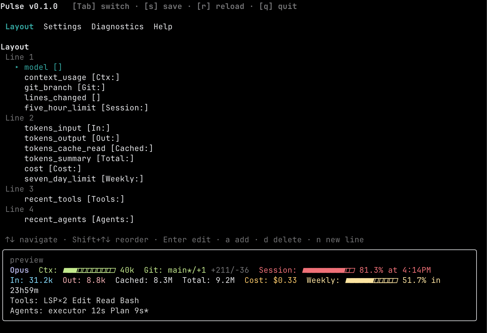

[English](./README.md) | [中文](./README.zh-CN.md)

# pulse

[](https://www.npmjs.com/package/@hwwwww/pulse)
[](./LICENSE)
[](https://bun.sh)
[](https://www.npmjs.com/package/@hwwwww/pulse)
[](https://www.npmjs.com/package/@hwwwww/pulse)
[](https://github.com/Hwwwww-dev/pulse/pulls)
[](https://github.com/Hwwwww-dev/pulse/issues)
[](https://github.com/Hwwwww-dev/pulse/commits)
[](https://github.com/Hwwwww-dev/pulse/stargazers)

**A statusline for [Claude Code](https://claude.ai/code) that actually shows you what's going on.**
Context pressure, token burn, cost, rate limits, git state — glanceable at all times.



---

## ✨ Features

- **Interactive TUI editor** — live preview, color pickers, drag-reorder items across lines; no JSON editing required
- **30+ item types** — model, cost, tokens in/out/cache, context usage, 5h & weekly limits with reset countdowns, recent tools/agents, todos progress, git branch, clock, custom shell commands
- **Dynamic color ramps** — bars shift green→yellow→red as danger thresholds are crossed; threshold is tunable per item
- **14 bar styles** — thin, block, braille, and more; mix per item
- **Multi-line layouts** — per-line background colors and rich glyph styling
- **Per-sub-part style targeting** — color the label, bar, and value of one item independently
- **Incremental JSONL cursor** — re-parses only new bytes each render; stays fast on long sessions

---

## 🔒 Offline

> **Pulse runs fully offline and 100% locally.** No network calls, no telemetry, no API keys — it only reads:
>
> - the JSON payload Claude Code pipes on stdin,
> - Claude Code's own session JSONL transcripts on your local disk,
> - Claude Code's user settings at `~/.claude/settings.json` (for ambient state like thinking effort, output style, sandbox mode).
>
> ⚠️ Because the **5-hour** and **weekly** rate-limit values come from that stdin payload, they refresh only when Claude Code pushes a new statusline tick — so they may lag slightly behind the live counters shown inside Claude Code itself.

---

## 🚀 Install

```bash
bunx @hwwwww/pulse@latest
```

No global install needed — runs directly via `bunx`. For frequent use you can install globally: `bun add -g @hwwwww/pulse`.

Runtime: requires **Bun ≥ 1.3** — the binary uses Bun's shebang.

---

## ⚙️ Setup

Add one entry to `~/.claude/settings.json`:

```json
{
  "statusLine": {
    "type": "command",
    "command": "bunx @hwwwww/pulse@latest",
    "padding": 0
  }
}
```

Restart Claude Code. The statusline appears immediately.

---

## 🎨 Customize

Run `bunx @hwwwww/pulse@latest` with no arguments to open the TUI editor (or `pulse` if installed globally):

```bash
bunx @hwwwww/pulse@latest
```

Config file location: `~/.pulse/config.json`

You can hand-edit it directly or use the in-app editor — both stay in sync. The TUI provides a live preview, color picker, threshold tuner, and item reordering across lines.

Hand-edited example:

```json
{
  "lines": [{
    "items": [
      { "id": "m", "type": "model",         "style": { "color": "#957FB8", "bold": true } },
      { "id": "c", "type": "context_usage", "options": { "dynamic_color": true, "show_bar": true } },
      { "id": "g", "type": "git_branch",    "style": { "color": "#98BB6C" } },
      { "id": "$", "type": "cost",          "options": { "format": "usd2" } }
    ]
  }]
}
```

---

## 📦 Item types

40 built-in items, grouped by purpose. Add any of them via the in-app type picker.

| Category | Items |
|---|---|
| **Session** | `model` · `session_name` · `session_id` · `agent_name` · `output_style` · `vim_mode` · `version` · `clock` |
| **Workspace** | `cwd` · `project_dir` · `worktree` · `git_branch` |
| **Cost & Duration** | `cost` · `duration` · `api_duration` · `lines_changed` |
| **Tokens** | `tokens_input` · `tokens_output` · `tokens_cache_read` · `tokens_cache_create` · `tokens_summary` · `token_rate` |
| **Context** | `context_usage` · `context_bar` |
| **Rate limits** | `five_hour_limit` · `seven_day_limit` · `five_hour_bar` · `seven_day_bar` · `reset_in_5h` · `reset_in_7d` |
| **Counters** | `tool_calls` · `agent_calls` · `skill_calls` · `tool_call` |
| **Activity** | `recent_agents` · `recent_tools` · `todos_progress` |
| **Custom** | `custom_command` · `text` · `spacer` |

Each item supports per-instance `style`, `label`, `format`, dynamic color thresholds, and width padding. The full schema lives in [`src/config/schema.ts`](./src/config/schema.ts).

---

## 🛠️ Development

Want to hack on pulse or contribute a new item type? Clone and run locally:

```bash
git clone https://github.com/Hwwwww-dev/pulse.git
cd pulse
bun install
bun run dev          # run the editor against your real config
bun test             # run the test suite
bun run typecheck    # strict TypeScript check
bun run build        # produce dist/pulse.js
```

Project layout:

- `src/cli/`      — CLI entry, render-mode pipeline
- `src/render/`   — item renderers, format helpers, engine
- `src/ui/`       — Ink-based TUI editor (pages, components, hooks)
- `src/config/`   — schema, themes, palette, persistence
- `test/`         — Bun test suite

PRs and issues are welcome — see the [issue tracker](https://github.com/Hwwwww-dev/pulse/issues).

---

## ⭐ Star History

[](https://star-history.com/#Hwwwww-dev/pulse&Date)

If pulse helps your daily flow, a ⭐ on GitHub means a lot — thanks!

---

## 🙏 Acknowledgments

Pulse was built standing on the shoulders of giants:

- [Claude Code](https://claude.ai/code) — the agentic coding tool this statusline was made for
- [Bun](https://bun.sh) — the runtime, bundler, and test runner that keeps pulse fast
- [Ink](https://github.com/vadimdemedes/ink) — React for interactive command-line apps, powering the TUI editor
- [Zod](https://zod.dev) — runtime schema validation for the config file
- Inspired by [ccstatusline](https://github.com/sirmalloc/ccstatusline) and [claude-hud](https://github.com/jarrodwatts/claude-hud) — thanks for paving the way

Special thanks to everyone who has filed issues, suggested item types, or starred the repo. ⭐

## 📜 License

MIT © [hwwwww](https://github.com/Hwwwww-dev)
